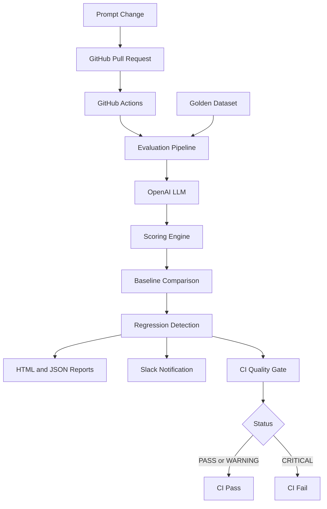
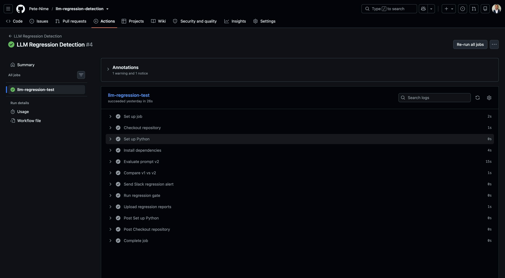

# LLM Regression Detection System

**Automated evaluation, regression detection, and CI/CD quality control for LLM applications.**

Developed by **Areca Tech Ltd**.

[](https://github.com/Pete-Nime/llm-regression-detection/actions/workflows/llm-regression.yml)

## 1. Project Overview

Large Language Models (LLMs) can produce different results when prompts are modified. Even small prompt changes may introduce unexpected failures.

This project provides an automated system to detect these regressions before deployment.

The system:

- Evaluates LLM responses against a golden dataset.
- Measures classification accuracy and summary quality.
- Compares new prompt versions against a baseline.
- Identifies regressions and improvements.
- Generates JSON and HTML evaluation reports.
- Stores evaluation history in SQLite.
- Applies CI quality gates.
- Sends automated Slack notifications.
- Integrates with GitHub Actions and pull requests.

## 2. Business Problem

Imagine a company using AI to classify thousands of customer support emails.

An engineer improves the classification prompt, but the new version incorrectly categorizes some billing complaints as account issues.

Without automated evaluation, these errors could reach production.

**Our solution:** Evaluate prompt changes automatically, compare results against a trusted baseline, and alert engineers when quality deteriorates.

## 3. System Architecture



## 4. Technology Stack

| Technology | Purpose |
|---|---|
| Python | Evaluation and automation |
| OpenAI API | LLM classification |
| Pydantic | Structured output validation |
| YAML | Versioned prompt configuration |
| JSON | Golden dataset and reports |
| SQLite | Evaluation history |
| Jinja2 | HTML report generation |
| Requests | Slack webhook integration |
| GitHub Actions | CI/CD automation |
| Slack | Regression notifications |
| Git and GitHub | Version control and pull requests |

## 5. Project Structure

```text
llm-regression-detection/
├── .github/
│   └── workflows/
│       └── llm-regression.yml
├── data/
│   └── golden_dataset.json
├── history/
│   └── evaluations.db
├── prompts/
│   ├── v1.yaml
│   └── v2.yaml
├── reports/
│   ├── evaluation_v1.json
│   ├── evaluation_v2.json
│   ├── comparison_report.json
│   └── evaluation_report.html
├── src/
│   ├── __init__.py
│   ├── classifier.py
│   ├── models.py
│   ├── evaluator.py
│   ├── comparator.py
│   ├── reporter.py
│   ├── history.py
│   ├── config.py
│   ├── run_comparison.py
│   ├── ci_gate.py
│   └── slack_notifier.py
├── tests/
├── .gitignore
├── README.md
└── requirements.txt
```

The SQLite database is generated locally and excluded from version control.

## 6. Evaluation Results

Example results from a successful GitHub Actions run:

| Metric | Result |
|---|---|
| Baseline accuracy | 93.33% |
| Current accuracy | 100.00% |
| Accuracy improvement | +6.67 percentage points |
| Regressions | 0 |
| Regression status | WARNING |
| GitHub Actions | SUCCESS |
| Slack notification | Delivered |

**Important:** WARNING does not necessarily mean the classification accuracy declined. Other configured thresholds, such as summary quality, may trigger a warning.

Results can vary between LLM executions.

## 7. Installation

### Clone the repository

```bash
git clone https://github.com/Pete-Nime/llm-regression-detection.git
cd llm-regression-detection
```

### Create a virtual environment

```bash
python3 -m venv .venv
source .venv/bin/activate
```

On Windows:

```powershell
.venv\Scripts\activate
```

### Install dependencies

```bash
pip install -r requirements.txt
```

### Configure your OpenAI API key

Create a `.env` file in the project root:

```dotenv
OPENAI_API_KEY=your_openai_api_key_here
```

Never commit `.env` or actual API credentials.

## 8. Run the Evaluation

Evaluate the baseline prompt:

```bash
python -m src.evaluator v1
```

Evaluate the updated prompt:

```bash
python -m src.evaluator v2
```

Compare both versions:

```bash
python -m src.run_comparison reports/evaluation_v1.json reports/evaluation_v2.json
```

Run the CI quality gate:

```bash
python -m src.ci_gate
```

## 9. Regression Detection

The comparison engine detects:

- **Regression:** A previously passing test now fails.
- **Improvement:** A previously failing test now passes.
- **Accuracy change:** The difference between baseline and current classification accuracy.
- **Summary quality:** Whether generated summaries meet the configured threshold.
- **Latency:** Whether response times exceed the configured limit.

The CI gate currently follows these rules:

| Status | CI Outcome |
|---|---|
| PASS | Exit code 0 |
| WARNING | Exit code 0 |
| CRITICAL | Exit code 1 |

Warnings are reported but do not automatically block deployment.

## 10. HTML Evaluation Dashboard

The system generates:

```text
reports/evaluation_report.html
```

The report provides an overview of:

- Baseline and current accuracy
- Accuracy changes
- Regression counts
- Improvement counts
- Evaluation status
- Reasons for warnings or critical failures

## 11. GitHub Actions Integration

Workflow:

```text
.github/workflows/llm-regression.yml
```

The workflow supports:

- Automatic execution on pull requests targeting `main`
- Manual execution through GitHub Actions
- LLM evaluation
- Baseline comparison
- Slack notification
- CI quality gate
- Uploading evaluation artifacts

Repository secrets required:

```text
OPENAI_API_KEY
SLACK_WEBHOOK_URL
```

Configure these in:

**GitHub → Settings → Secrets and variables → Actions**

## 12. Slack Regression Alerts

The system sends automated notifications to:

```text
Areca Tech → #llm-regression-alerts
```

Example notification:

```text
⚠️ LLM Regression Detection: WARNING

Accuracy Delta: +6.67%
Regressions: 0

Repository: llm-regression-detection
```

The Slack webhook URL is stored securely as a GitHub Actions repository secret.

## 13. Future Improvements

- Expand the golden dataset.
- Introduce semantic similarity and LLM-as-judge scoring.
- Add automated unit and integration tests.
- Add model cost and token usage tracking.
- Add statistical analysis for repeated evaluations.
- Improve regression severity policies.
- Support multiple LLM providers.
- Add deployment approval gates.
- Enhance Slack notifications with direct links to CI reports.

## 14. Author

**Peter Nime**

Software Engineering | AI Engineering | Data Engineering

**Areca Tech Ltd**

*Turning business problems into intelligent solutions.*

## 15. License

See the [LICENSE](LICENSE) file for license details.


## 16. Project Screenshots

### GitHub Actions — Successful CI Pipeline


### LLM Regression Detection Results


### Slack Regression Alert
